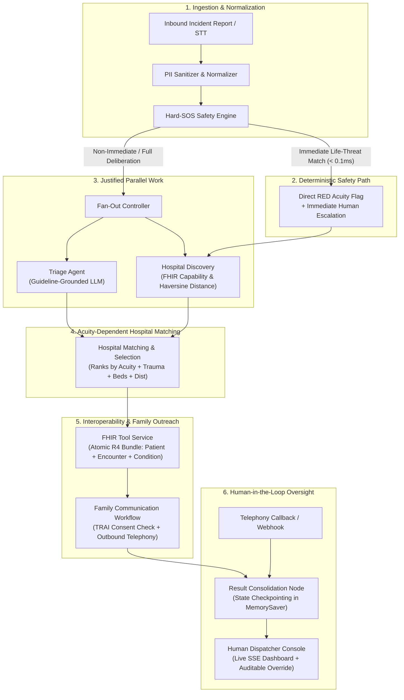

# GOLDEN: System Architecture & Technical Specification

> **Guideline-Grounded Orchestrated LLM Dispatch for Emergency Networks**  
> *Pre-Hospital Emergency Decision-Support Framework for Indian 108 / 112 Services*

> **Verified local baseline (2026-09-13):** HAPI FHIR R4 is running on port 8080. The Python test suite passes 36/36 tests. All workflows execute locally with deterministic safety engines, dependency-aware LangGraph orchestration, FHIR interoperability, and human dispatcher oversight.

The repeatable capstone demonstration and its evidence checkpoints are tracked in [CAPSTONE_EXECUTION_PLAN.md](CAPSTONE_EXECUTION_PLAN.md).

---

## 1. High-Level System Architecture

GOLDEN is a safety-first emergency coordination decision-support framework. It coordinates specialized triage, hospital-matching, FHIR interoperability, and family-communication workflows through a central LangGraph state machine. It grounds emergency medical classification in established protocols (AIIMS Emergency Department Triage Protocol, MoRTH Road Accident Golden Hour SOP 2025) while strictly retaining the human dispatcher as the final authority.



---

## 2. Component Classification

To maintain architectural integrity and academic rigor, components in GOLDEN are strictly classified into three categories:

### A. Non-Agent Infrastructure & Safety Engines
These components perform deterministic, rule-based, or operational functions and are **not** AI agents:
1. **Hard-SOS Safety Engine**: Deterministic regex pattern matcher for non-negotiable critical conditions (`cardiac arrest`, `unresponsive`, `severe bleeding`, `crushed limbs`, `head injury`). Execution latency < 0.02ms. Bypasses LLM inference completely.
2. **GOLDEN Orchestrator**: LangGraph `StateGraph` workflow controller managing state transitions, dependency-aware branching, join barriers, durable checkpointing, and webhook resumption.
3. **FHIR Tool / Service Layer**: Healthcare interoperability layer executing atomic HL7 FHIR R4 REST operations (`Organization`, `Patient`, `Encounter`, `Condition`). Does not make independent clinical decisions.
4. **Geospatial Distance Calculator**: Pure mathematical Haversine great-circle distance algorithm.
5. **Deterministic Hospital Scorer**: Multi-factor mathematical scoring function: $Score = f(\text{Acuity}, \text{TraumaLevel}, \text{ICUBeds}, \text{ERBeds}, \text{Distance})$.
6. **PII Sanitizer & Prompt Injection Detector**: Regex-based redaction of Indian Aadhaar, Phone, and PAN numbers, and adversarial jailbreak neutralization.
7. **Schema Gateways**: Pydantic v2 validation contracts enforcing type bounds at inter-workflow handoffs.

### B. Specialist Workflows & Specialist Agents
These components encapsulate specialized domain responsibilities:
1. **Triage Agent**: Guideline-grounded clinical reasoning agent using Gemini / Groq or deterministic keyword fallback to assign standardized clinical acuity (`RED`, `YELLOW`, `GREEN`, `BLACK`) with AIIMS/MoRTH protocol justification.
2. **Hospital Matching Workflow**: Two-stage specialist workflow:
   - *Stage 1 (Discovery)*: Retrieves candidate facilities and physical capabilities via FHIR (independent of acuity).
   - *Stage 2 (Matching)*: Applies validated clinical acuity from the Triage Agent to score facilities, select the destination hospital, and produce an explainable machine-readable `ranking_reason`.
3. **Family Communication Workflow**: Specialist outreach workflow managing TRAI TCCCPR 2018 consent verification, telephony dispatch, and structured collection of patient drug allergies, active medications, and blood group upon webhook callback.

### C. Human Dispatcher
The trained human emergency dispatcher retains absolute oversight and authority. The dispatcher reviews the full audit trail and can override acuity or destination hospital selection at any time. Every override is permanently logged with old/new values, timestamps, and dispatcher operational notes.

---

## 3. Justified Real Parallelism vs. Data Dependencies

| Workflow Step | Depends On | Execution Mode | Rationale |
| :--- | :--- | :--- | :--- |
| **Hard-SOS Check** | Raw Incident Report | Sequential (First) | Must run before any downstream work to guarantee immediate bypass for life threats. |
| **Triage Agent** | Incident Narrative + Context | **Parallel Branch A** | Requires LLM clinical deliberation over reported trauma symptoms. |
| **Hospital Discovery** | Incident GPS Coordinates | **Parallel Branch B** | Does **not** require triage acuity. Can query nearby organizations, capabilities, and calculate distances concurrently with triage reasoning. |
| **Hospital Matching** | **Both** Triage Acuity & Discovered Facilities | **Sequential Join Barrier** | **Cannot run concurrently with triage.** Accurate hospital selection depends on knowing whether the patient requires Level 1 trauma/ICU (`RED`) or urgent emergency care (`YELLOW`). |
| **FHIR Pre-Registration** | Selected Hospital & Case Identity | Sequential | Needs the selected destination hospital before writing `Patient`, `Encounter`, and `Condition` resources. |
| **Family Communication** | Approved Case Info & Contact | Asynchronous | Non-blocking outbound call initiated; pipeline checkpoints while awaiting family interaction. |

---

## 4. Shared State Model (`GoldenCaseState`)

All workflows communicate through a single strongly-typed Pydantic v2 data model:

```
GoldenCaseState
├── input_data (CaseIdentityInput)
│   ├── case_id: str
│   ├── caller_phone: Optional[str]
│   ├── raw_input: str
│   ├── language: str ("en", "ta", "ta-en-codemix")
│   ├── modality: Literal["text", "voice_stt", "manual_dispatcher"]
│   ├── location: IncidentLocation (lat, lon, landmark, district)
│   └── reported_at: datetime
│
├── triage (TriageOutput)
│   ├── acuity_level: Optional[Literal["RED", "YELLOW", "GREEN", "BLACK"]]
│   ├── hard_sos: bool
│   ├── hard_sos_triggers: List[str]
│   ├── confidence: float (0.0 to 1.0)
│   ├── rationale: Optional[str]
│   ├── guideline_reference: Optional[str]
│   ├── retry_count: int
│   └── triage_completed_at: Optional[datetime]
│
├── hospital_fhir (HospitalFhirOutput)
│   ├── raw_candidates: List[HospitalCandidate] (Discovered in Stage 1)
│   ├── candidate_hospitals: List[HospitalCandidate] (Ranked in Stage 2)
│   ├── selected_hospital_id: Optional[str]
│   ├── selected_hospital_name: Optional[str]
│   ├── ranking_reason: Optional[str] (Machine-readable justification)
│   ├── bed_status: Literal["NONE", "REQUESTED", "CONFIRMED", "UNAVAILABLE"]
│   ├── fhir_bundle_id: Optional[str]
│   ├── fhir_patient_id: Optional[str]
│   ├── fhir_encounter_id: Optional[str]
│   ├── fhir_condition_id: Optional[str]
│   ├── fhir_submission_status: Literal["PENDING", "SUCCESS", "FAILED"]
│   └── fhir_submission_timestamp: Optional[datetime]
│
├── voice_family (VoiceFamilyOutput)
│   ├── call_status: Literal["IDLE", "TRIGGERED", "IN_PROGRESS", "COMPLETED", "FAILED", "CONSENT_REFUSED"]
│   ├── call_id: Optional[str]
│   ├── recipient_phone: Optional[str]
│   ├── consent_granted: Optional[bool]
│   ├── allergies: List[str]
│   ├── medications: List[str]
│   ├── blood_group: Optional[str]
│   ├── pre_existing_conditions: List[str]
│   ├── call_summary: Optional[str]
│   ├── call_duration_seconds: Optional[int]
│   └── resumed_at: Optional[datetime]
│
└── control_audit (ControlAudit)
    ├── current_node: str
    ├── execution_stage: Literal[...]
    ├── active_provider: Literal["groq", "gemini", "openrouter", "ollama_local"]
    ├── fallback_active: bool
    ├── thread_id: str
    ├── errors: List[AuditError]
    ├── audit_trail: List[AuditLogEntry]
    ├── human_overrides: List[HumanOverrideRecord]
    ├── node_timings: Dict[str, NodeExecutionTiming]
    ├── started_at: datetime
    └── completed_at: Optional[datetime]
```

---

## 5. Engineering Design Patterns

1. **Dependency-Aware LangGraph State Machine**: Orchestrator executes real parallel fan-out where data dependencies permit (Triage reasoning $\parallel$ Hospital discovery) and enforces sequential join barriers where dependencies exist (Acuity matching requires Triage output).
2. **Deterministic Sub-Millisecond Safety Engine**: Hard-SOS executes sub-second regex evaluation prior to external API calls. Biased toward false positives to minimize fatal false negatives.
3. **Pydantic Contract Enforcement**: Strong type bounds at all state transitions prevent schema drift or corrupted handoffs.
4. **Idempotent FHIR R4 Bundle Transactions**: Atomic pre-registration bundles prevent duplicate patient admissions in local HAPI FHIR storage.
5. **Durable Checkpointing & Webhook Resumption**: Powered by LangGraph's `MemorySaver`, allowing the system to pause during long-running telephony interactions and resume seamlessly upon webhook receipt.
6. **Auditable Human-in-the-Loop Governance**: Every operational override by the dispatcher is recorded with before/after state diffs, timestamps, and mandatory operational justification.
