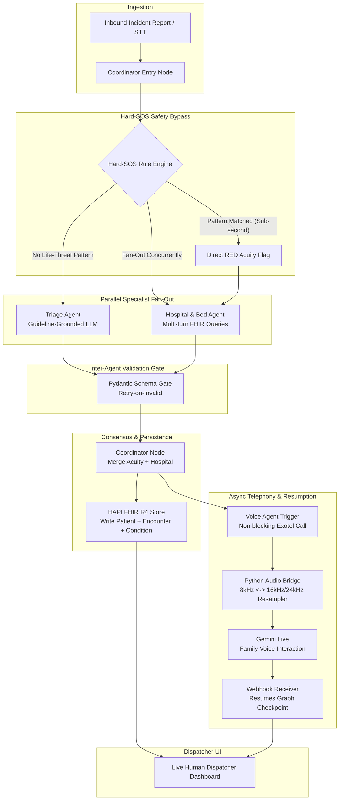

# GOLDEN: System Architecture & Technical Specification

> **Guideline-Grounded Orchestrated LLM Dispatch for Emergency Networks**  
> *Pre-Hospital Emergency Decision-Support Pipeline for Indian 108 / 112 Services*

---

## 1. High-Level System Architecture

GOLDEN replaces the traditional serial telephone-based emergency dispatch workflow with a parallelized, multi-agent decision-support architecture coordinated by LangGraph. It grounds emergency medical classification in established protocols (e.g., AIIMS Emergency Triage, MoRTH Golden Hour SOP 2025) while strictly retaining the human dispatcher in the loop.



---

## 2. Core Agents & Roles

| Agent | Responsibility | Latency Target | Technology / Model |
| :--- | :--- | :--- | :--- |
| **Coordinator** | Orchestrator owning control flow, state machine, conditional branching, and durable checkpointing. | < 50ms | LangGraph (StateGraph, Checkpointer) |
| **Hard-SOS Rule Engine** | Deterministic keyword and regex matcher for immediate life threats (`unresponsive`, `severe bleeding`, `no pulse`, `cardiac arrest`). Sub-second bypass around LLM inference. Biased toward false positives to minimize fatal false negatives. | < 10ms | Pure Python regex (zero LLM calls) |
| **Triage Agent** | Guideline-grounded clinical reasoning over unstructured caller text. Emits acuity category (`RED`, `YELLOW`, `GREEN`, `BLACK`), confidence score, clinical rationale, and guideline reference. | < 2.5s | Groq (Llama 3.3 70B / Qwen 3.6 27B) or Gemini 3.6 Flash |
| **Hospital & Bed Agent** | Iterative multi-turn FHIR queries against local HAPI FHIR store. Assesses simulated ER/ICU bed availability, trauma level matching, and geographic proximity. Submits pre-registration FHIR Bundle. | < 2.0s | FHIR R4 REST API + Decision Scorer |
| **Voice Agent** | Automated, non-blocking outbound telephony to next-of-kin. Collects critical patient history (allergies, medications, blood group). Resumes paused LangGraph checkpoint upon webhook completion. | Asynchronous (1–3 min) | Exotel API + NumPy/SciPy Audio Bridge + Gemini Live |

---

## 3. Shared State Model (`GoldenCaseState`)

All agent interactions read from and write to a single strongly-typed Pydantic v2 model divided into five domains:

```
GoldenCaseState
├── input_data (CaseIdentityInput)
│   ├── case_id: str
│   ├── caller_phone: Optional[str]
│   ├── raw_input: str
│   ├── language: str ("en", "ta", "ta-en-codemix")
│   ├── modality: Literal["text", "voice_stt", "manual_dispatcher"]
│   ├── location: IncidentLocation (lat, lon, landmark, district)
│   └── reported_at: datetime
│
├── triage (TriageOutput)
│   ├── acuity_level: Optional[Literal["RED", "YELLOW", "GREEN", "BLACK"]]
│   ├── hard_sos: bool
│   ├── hard_sos_triggers: List[str]
│   ├── confidence: float (0.0 to 1.0)
│   ├── rationale: Optional[str]
│   ├── guideline_reference: Optional[str]
│   ├── retry_count: int
│   └── triage_completed_at: Optional[datetime]
│
├── hospital_fhir (HospitalFhirOutput)
│   ├── candidate_hospitals: List[HospitalCandidate]
│   ├── selected_hospital_id: Optional[str]
│   ├── selected_hospital_name: Optional[str]
│   ├── bed_status: Literal["NONE", "REQUESTED", "CONFIRMED", "UNAVAILABLE"]
│   ├── fhir_bundle_id: Optional[str]
│   ├── fhir_patient_id: Optional[str]
│   ├── fhir_encounter_id: Optional[str]
│   ├── fhir_condition_id: Optional[str]
│   ├── fhir_submission_status: Literal["PENDING", "SUCCESS", "FAILED"]
│   └── fhir_submission_timestamp: Optional[datetime]
│
├── voice_family (VoiceFamilyOutput)
│   ├── call_status: Literal["IDLE", "TRIGGERED", "IN_PROGRESS", "COMPLETED", "FAILED", ...]
│   ├── call_id: Optional[str]
│   ├── recipient_phone: Optional[str]
│   ├── consent_granted: Optional[bool]
│   ├── allergies: List[str]
│   ├── medications: List[str]
│   ├── blood_group: Optional[str]
│   ├── pre_existing_conditions: List[str]
│   ├── call_summary: Optional[str]
│   └── call_duration_seconds: Optional[int]
│
└── control_audit (ControlAudit)
    ├── current_node: str
    ├── execution_stage: Literal[...]
    ├── active_provider: Literal["groq", "gemini", "openrouter", "ollama_local"]
    ├── fallback_active: bool
    ├── thread_id: str
    ├── errors: List[AuditError]
    ├── audit_trail: List[AuditLogEntry]
    ├── started_at: datetime
    └── completed_at: Optional[datetime]
```

---

## 4. Key Engineering Design Patterns

1. **Orchestrator–Worker Fan-Out**: The Coordinator manages graph edges and delegates concurrently to Triage and Hospital nodes using LangGraph's asynchronous execution, slashing end-to-end latency.
2. **Deterministic Hard-SOS Fast-Path**: Eliminates LLM latency and non-deterministic hallucinations for critical life threats by routing directly to hospital dispatch within milliseconds.
3. **Pydantic Schema Validation Gates**: Every agent output is parsed against strict Pydantic schemas. Validation failures trigger a structured retry loop with schema feedback; persistent failures route to human fallback.
4. **Idempotent FHIR Bundles**: Pre-registration bundles (Patient + Encounter + Condition) use client-generated UUIDs so retries do not produce duplicate hospital encounters.
5. **Durable Checkpointing & Webhook Resumption**: The Voice Agent execution is decoupled. LangGraph saves state to its checkpointer; when the external call concludes, an incoming webhook triggers graph resumption with collected medical history.
